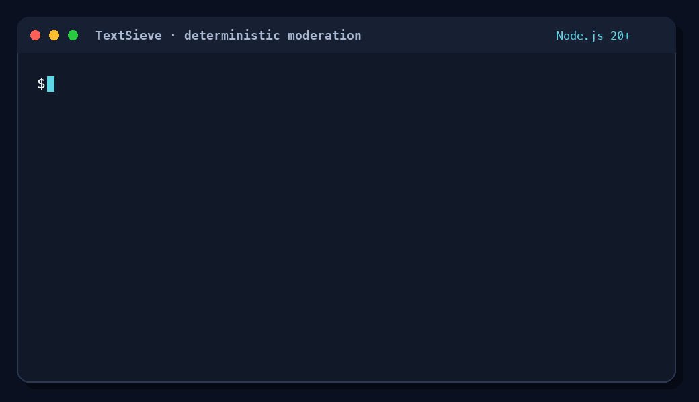

# TextSieve

[](https://www.npmjs.com/package/textsieve)
[](https://github.com/dev-ik/textsieve/actions/workflows/ci.yml)
[](https://www.npmjs.com/package/textsieve)
[](LICENSE)

English | [Русский](README.ru.md)

TextSieve is a deterministic text quality and safety firewall for JavaScript and TypeScript. It detects explicit abuse, conservative obfuscation, suspicious Unicode, spam-like formatting and basic gibberish without AI, remote APIs, telemetry or network requests.



Run the same inspection flow locally with [examples/demo.mjs](examples/demo.mjs).

The project is under active development. The current dictionaries are deliberately small and are not yet suitable as the only moderation layer for a production service.

## Runtime and development requirements

- Node.js 20 or newer at runtime
- Node.js 24 LTS and npm 11 for repository development

Node.js 20 compatibility is continuously tested, but Node.js 20 itself is end-of-life. Prefer an actively supported LTS release for production deployments.

The core and language packages have no runtime dependencies. The `textsieve` convenience package depends only on the three matching TextSieve packages it re-exports.

Version 0.1.x publishes ESM-only packages. Node.js applications must use `import`; CommonJS `require()` is not supported.

## Development

```bash
nvm use
npm install
npm run typecheck
npm test
npm run release:check
npm run build
npm run benchmark
```

## Usage

```bash
npm install textsieve
```

```ts
import { createSieve, en, ru } from "textsieve";

const sieve = createSieve({
  languagePacks: [ru, en],
  expectedLanguage: "ru",
  safetyLanguages: ["ru", "en"],
  transliteration: {
    enabled: true,
    targets: ["ru"]
  },
  preset: "public-form"
});

const result = sieve.inspect("ах ты bitch");

console.log(result.decision); // reject
console.log(result.issues);   // explainable source spans and match metadata
```

`expectedLanguage` controls the language-mismatch signal. `safetyLanguages` independently controls which abuse dictionaries run. Latin technical terms inside Russian text are not rejected merely for using Latin script.

For smaller bundles, install only the modules you need: `@textsieve/core`, `@textsieve/ru` and/or `@textsieve/en`. The `textsieve` package is a convenience entry point that re-exports those three packages.

## API

- `inspect(text)` returns the full immutable inspection result.
- `check(text)` returns `true` only when the decision is `allow`.
- `normalize(text)` returns NFKC/lowercase derived text.
- `sanitize(text)` additionally removes unsafe controls and collapses whitespace.

Issue `start` and `end` positions are half-open UTF-16 offsets into the original `input`, even when a match was found through a derived token candidate.

## Security and privacy

TextSieve performs no network requests and sends no telemetry. Raw text remains inside the host process.

Browser-side checks are only a user-experience aid. Any enforcement decision must be repeated on a trusted server using the same version and configuration.

## Language data and licensing

The initial RU/EN safety lists and test fixtures are original, manually curated project data distributed under the repository's MIT License. No external dictionary or corpus is bundled. See [data provenance](docs/DATA_PROVENANCE.md) before contributing language data.

## Current limitations

- RU/EN dictionaries and clean corpora require further expansion and calibration.
- Gibberish detection is intentionally conservative.
- Framework adapters, CLI, remote dictionaries, AI fallback and WASM are outside v0.1.0.
- Distributed under the MIT License.

See the [documentation index](docs/README.md), [implementation specification](docs/SPEC.md) and [architecture decisions](docs/adr/) for details.
